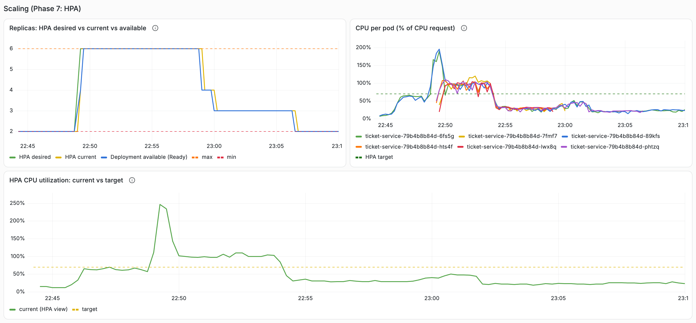
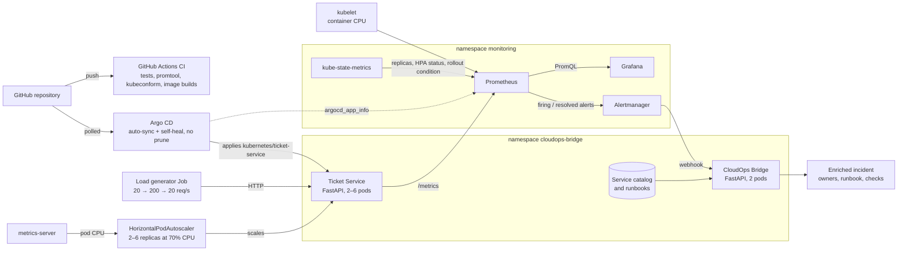
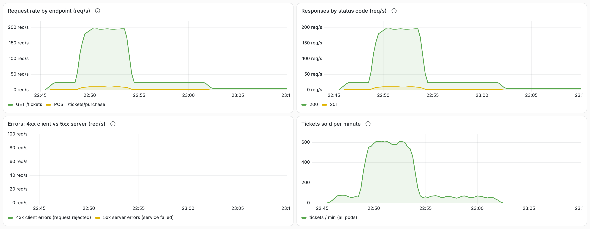
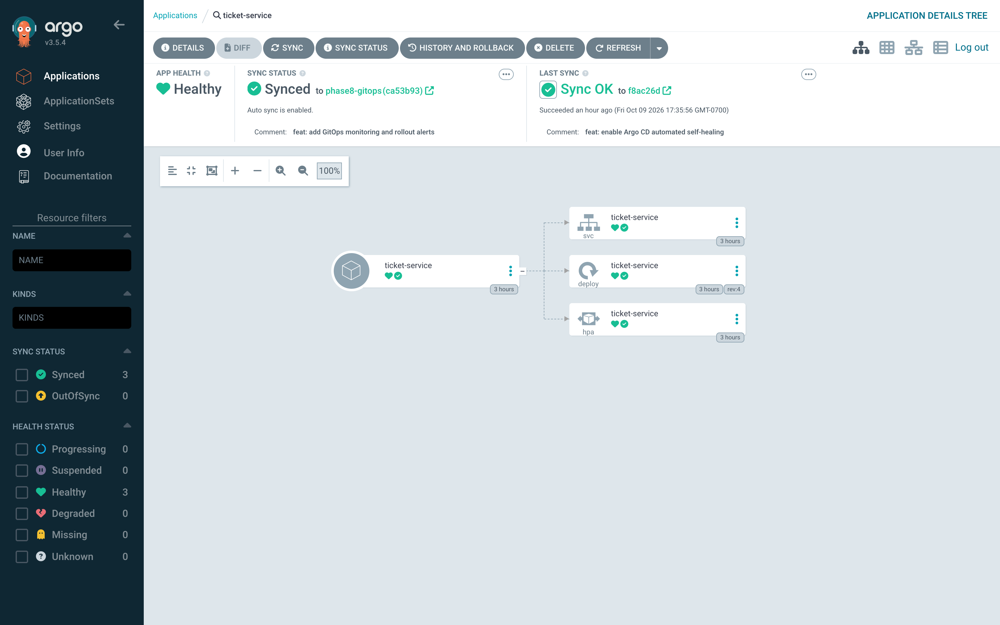
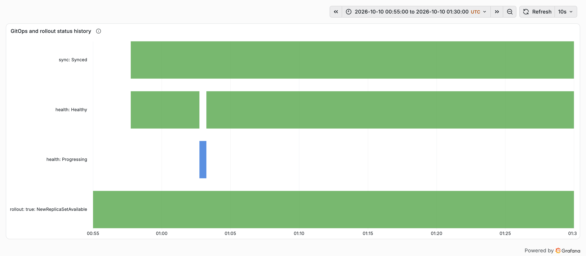

# CloudOps Bridge

**Operational context for on-call engineers, on a local Kubernetes platform that monitors, alerts on, autoscales and GitOps-deploys a fictional ticketing service.**

A bare alert such as *"TicketServiceTargetDown on ticket-api in production"* tells an on-call engineer very little. CloudOps Bridge turns it into an **enriched incident**: who owns the service, who responds first, what it depends on, which runbook to open and what to check first. Around it, a local Kubernetes platform runs the ticketing workload with health probes, Prometheus monitoring, Alertmanager alerting and CPU-based autoscaling, validates every change in GitHub Actions, and deploys the service from Git with Argo CD.

> Fictional demonstration project. All services, teams and data are made up. Everything runs locally on a single-node [kind](https://kind.sigs.k8s.io/) cluster; no cloud account is needed.



*Grafana during the measured on-sale spike: the HPA scaled ticket-service from 2 to 6 replicas (its configured maximum) and back to 2. Real data from the acceptance run, 22:44–23:10 UTC.*

## CloudOps Bridge in 60 seconds

The project is about the operational workflow around a service (seeing it, scaling it, getting useful alerts, and changing it safely), not about the application itself.

- **A sample ticketing application runs on Kubernetes.** Customers can browse and buy tickets through a small web API.
- **It grows with demand.** When many customers arrive at once, Kubernetes automatically starts more copies (pods) of the application, and removes them when traffic drops.
- **Problems are detected automatically.** Monitoring checks every copy of the application and raises an alert when one stops responding.
- **Alerts arrive with context.** CloudOps Bridge adds what the on-call engineer needs first: the responsible team, who responds first, what the service depends on, which runbook to open and what to check.
- **Changes go through Git.** GitHub Actions validates every change; Argo CD deploys what is in Git and automatically reverts manual changes to the deployed configuration.
- **Bad releases are visible and recoverable.** A release that can't start is reported (Argo CD health, a rollout alert, a Grafana panel) while the previous version keeps serving, and `git revert` brings the previous version back.

### What was verified

These results come from a **local Kubernetes demonstration on a single laptop**, not from a production environment. They show how the system behaves, not production capacity.

- **60,000 requests with zero failures** during a simulated ticket-sale spike (200 requests per second for five minutes), in the measured run.
- **Automatic scaling from 2 to 6 pods and back to 2** in the same run, without manual intervention.
- **A real service failure became an enriched incident.** A stopped application process triggered a real alert, which CloudOps Bridge enriched with incident information, followed by a resolved notification when Kubernetes recovered the pod.
- **A Git-driven deployment with no failed checks.** A new image tag committed to Git was rolled out by Argo CD; an in-cluster checker recorded 2,913 of 2,913 successful requests during that rollout.
- **A broken release didn't take the service down.** A deliberately bad image tag never started, the previous version kept serving (8,708 of 8,708 checks succeeded), and `git revert` restored the release.
- **Manual changes were reverted automatically.** With self-heal on, a changed Deployment field was restored from Git in about 1.2 seconds.
- **Not every number is perfect.** When a process was frozen, 4 of 2,867 checks timed out in the roughly 8 seconds before Kubernetes stopped sending it traffic (see [Known limitations](#known-limitations)).

Each result comes from its own measured run; the numbers are not combined.

### See it working

- [Grafana: autoscaling](docs/images/grafana-autoscaling.png): replicas, CPU per pod and the HPA target during the spike
- [Grafana: traffic and errors](docs/images/grafana-traffic-errors.png): request rate and status codes, with no errors
- [Grafana: full dashboard](docs/images/grafana-full-dashboard.png)
- [Argo CD: ticket-service Synced and Healthy](docs/images/argocd-application.png)
- [Grafana: GitOps and rollout status history](docs/images/grafana-gitops-history.png)
- [Real incident-enrichment example](#example-enriched-incident-real-values-from-the-rebuilt-cluster-run)
- [GitOps results](#results-gitops-deployment-and-recovery) and [GitOps documentation](gitops/README.md)
- [Architecture diagram](#architecture)
- [Runbooks](runbooks/)
- [Demo walkthrough](docs/demo.md)

## The problem

On-call engineers lose the first minutes of an incident answering the same questions: which service, which environment, who owns it, what it depends on, where the runbook is, what to check first. CloudOps Bridge answers them from a **service catalog**, one YAML file per service that the Development and CloudOps teams agree on as their operational handoff. The knowledge lives in version control instead of in someone's head.

## Key capabilities

- **Incident enrichment.** Alertmanager sends real firing and resolved alerts to the Bridge's webhook. The Bridge maps the alert's labels (`alertname`, `service`, `environment`) to owners, first responder, dependencies, endpoints, runbook and suggested checks from `service-catalog/` and `runbooks/`. Unknown alerts are reported as `unmapped`; no runbook is invented.
- **Monitoring.** Prometheus discovers every ticket-service pod through the Kubernetes API and scrapes it directly. Grafana shows traffic, status codes, errors, per-pod inventory and scaling, provisioned from Git.
- **Alerting.** `TicketServiceTargetDown`, `HighErrorRate` and `TicketServiceRolloutStuck` rules, validated with `promtool` and `amtool`, with rule unit tests.
- **Autoscaling.** A HorizontalPodAutoscaler keeps ticket-service between 2 and 6 replicas at 70% of its CPU request, driven by real ticket traffic. No artificial CPU-burning endpoint exists.
- **Kubernetes operations.** Liveness and readiness probes, requests and limits, zero-drop rolling updates, rollback, and hardened, non-root containers.
- **GitOps with Argo CD.** Argo CD v3.5.4 deploys ticket-service from Git with automated sync and self-heal; automatic pruning is off. An AppProject limits it to this repository, one namespace and three resource kinds. The HPA keeps sole ownership of the replica count.
- **CI with GitHub Actions.** Every push runs the tests, `promtool`/`amtool`, `kubeconform` schema validation and both image builds, with third-party actions pinned by commit SHA.
- **Rollout monitoring.** `TicketServiceRolloutStuck` fires when a rollout exceeds its progress deadline, and Grafana shows Argo CD sync and health status next to the Deployment's rollout condition.

## Architecture



**Responsibilities:** Argo CD *deploys* what is in Git, Prometheus *detects*, Alertmanager *delivers*, the Bridge *explains*. GitHub Actions validates changes, but Argo CD doesn't wait for it (see [Known limitations](#known-limitations)). The Bridge doesn't diagnose root causes or remediate anything.

## Results: autoscaling under a ticket on-sale spike

In a local single-node kind experiment, a 200 req/s ticket-traffic spike drove HPA scaling from 2 to 6 pods; all 60,000 spike requests completed successfully in that run. The traffic was real `GET /tickets` browsing plus 5% single-ticket purchases from an in-cluster load generator. The cluster was freshly built using only the documented commands.

| Time after spike start | Event |
|---|---|
| +24 s | HPA scaled **2 → 4** (CPU 111% of request vs 70% target) |
| +39 s | HPA scaled **4 → 6**, the configured maximum (CPU 247%) |
| +51 s | **All six pods Ready** |
| after the spike | Scale-down after the 300 s stabilization window: **6 → 4 → 3 → 2** |

| Stage | Configured | Achieved | Requests | Failed |
|---|---|---|---|---|
| Normal | 20 req/s for 3 min | 20.0 req/s | 3,600 | 0 |
| Spike | 200 req/s for 5 min | 200.0 req/s | 60,000 | 0 |
| Recovery | 20 req/s for 8 min | 20.0 req/s | 9,600 | 0 |

- An **independent availability checker** ran separately for the whole event (35 min, including every scale-down) and measured **10,197 successful checks and 0 failures**.
- **Six replicas was the configured maximum, and CPU remained above the 70% target during the spike.** More capacity would have been needed to reach the target.
- This is one run on one laptop node. It shows how Kubernetes reacts to a spike; it is **not** a benchmark or a production capacity result.



*Same window: request rate, responses by status code (only 200 and 201), and 4xx/5xx errors at zero throughout.*

Full method, timeline, per-stage numbers and findings: [kubernetes/README.md, section 11](kubernetes/README.md#11-autoscaling-hpa).

## Results: incident enrichment

When Prometheus detects an unavailable ticket-service target, Alertmanager sends a real webhook to CloudOps Bridge, which maps stable alert labels to operational context from the service catalog and runbooks.

Verified live multiple times, including with the HPA enabled and with Argo CD managing ticket-service, by freezing one ticket-service process:

- Prometheus fired `TicketServiceTargetDown`, and Alertmanager's own webhook reached the Bridge about 9 s after Alertmanager received the alert (its `group_wait`). The Bridge logged `outcome=enriched` with the full context.
- After Kubernetes restarted the pod, the **resolved** webhook arrived 60 s after the firing one (`group_interval`), with the same alert fingerprint.
- Alertmanager recorded 0 failed deliveries.

### Example enriched incident (real values from the rebuilt-cluster run)

| Field | Value |
|---|---|
| Alert | `TicketServiceTargetDown`, status `firing`, severity `warning` |
| Service / environment | `ticket-api` / `production` |
| Affected | pod `ticket-service-79b4b8b84d-5x6wk`, instance `10.244.0.10:8080` |
| First responder | `cloudops` |
| Application owner | Ticket Development |
| CloudOps owner | CloudOps |
| Dependency | `postgresql` (declared in the catalog; not deployed in this project) |
| Health / readiness | `/health`, `/ready` |
| Runbook | [`ticket-service-target-down.md`](runbooks/ticket-service-target-down.md) |
| Fingerprint | `c850a769b919ceef` |

Suggested checks, from the catalog:

1. Check whether Kubernetes already restarted or replaced the pod (RESTARTS, pod age)
2. Check the pod's readiness and liveness state and recent events
3. Read the scrape error on the Prometheus target (timeout vs connection refused)
4. Read the previous container's logs if the pod restarted
5. Confirm the other replica is Ready and serving traffic
6. Check rollout history for a deployment in progress

<details>
<summary>The Bridge's log lines for this incident</summary>

```
2026-10-08 21:34:55,502 INFO bridge event=webhook_received receiver=cloudops-bridge group_status=firing alerts=1 truncated=0
2026-10-08 21:34:55,506 INFO bridge event=alert_processed status=firing outcome=enriched alertname=TicketServiceTargetDown service=ticket-api environment=production severity=warning pod=ticket-service-79b4b8b84d-5x6wk instance=10.244.0.10:8080 runbook=ticket-service-target-down.md fingerprint=c850a769b919ceef reason=-
2026-10-08 21:34:55,506 INFO bridge event=incident_context fingerprint=c850a769b919ceef severity=warning first_responder=cloudops application_owner="Ticket Development" cloudops_owner=CloudOps dependencies=postgresql health=/health readiness=/ready runbook=ticket-service-target-down.md checks=6
2026-10-08 21:35:55,507 INFO bridge event=webhook_received receiver=cloudops-bridge group_status=resolved alerts=1 truncated=0
2026-10-08 21:35:55,508 INFO bridge event=alert_processed status=resolved outcome=enriched alertname=TicketServiceTargetDown service=ticket-api environment=production severity=warning pod=ticket-service-79b4b8b84d-5x6wk instance=10.244.0.10:8080 runbook=ticket-service-target-down.md fingerprint=c850a769b919ceef reason=-
```

</details>

Full routing, payload handling, outcomes and the end-to-end procedure: [kubernetes/monitoring/README.md, section 11](kubernetes/monitoring/README.md#11-incident-enrichment-alertmanager--cloudops-bridge).

## Results: GitOps deployment and recovery

Argo CD manages ticket-service from Git; the HPA owns the replica count. Each row is a separate measured run on the local kind cluster. Availability was measured from inside the cluster, through the Service, at 5 requests per second.

| Test | What happened | Availability checks |
|---|---|---|
| Adoption | Argo CD took over the running resources: the only diff was its tracking annotation; no pod was restarted | n/a |
| HPA under Argo CD | The on-sale spike scaled 2 → 6 → 2 while the Application stayed **Synced** in 976 of 976 samples; Argo CD started no sync. Load generator: 73,185 requests, 0 failed responses, 15 not sent because the generator itself was saturated at the start of the spike | 10,223 ok, 0 failed |
| Git-driven deployment | Commit → CI → OutOfSync → manual sync → rolling update to the new image tag in about 14 s. Argo CD then showed Degraded for 30 s while the HPA waited for the new pods' first CPU metrics | **2,913 / 2,913** ok |
| Bad release | A never-built image tag: new pod `ErrImageNeverPull`, progress deadline exceeded after 121 s, Argo CD **Synced but Degraded**, old pods kept serving; `git revert` recovered in about 2 s after sync | **8,708 / 8,708** ok |
| Self-heal | A manual change to `progressDeadlineSeconds` was reverted by an automated sync in about 1.2 s, with no pod restart | **2,911 / 2,911** ok |
| Incident under Argo CD | Frozen process → `TicketServiceTargetDown` firing (+32 s) → enriched webhook (+40 s) → resolved (+100 s), same fingerprint; no Argo CD sync | 2,863 / 2,867 ok (4 timeouts) |



*Argo CD after the GitOps tests: Synced and Healthy, automated sync on, managing the ticket-service Service, Deployment and HPA.*



*Grafana's GitOps row during the incident test: Synced throughout; health briefly Progressing while the frozen pod was NotReady.*

Details, timings and caveats for each run: [gitops/README.md, Verified results](gitops/README.md#verified-results).

## Engineering findings

Problems found by testing on a live cluster, and what changed because of them:

1. **Rolling updates dropped requests.** The first rolling update dropped 4 of 198 requests, even though it never went below 2 Ready pods: Kubernetes sends SIGTERM at the same time as it removes the pod from the Service, so the process exited before routing stopped sending it traffic. A 5 s `preStop` hook fixed it; every rollout test since measured 0 failed requests from inside the cluster.
2. **`kubectl rollout undo` can redeploy the broken release.** After an earlier rollback, `undo` went back to the bad image. The runbook now says to check the history and roll back to an explicitly chosen known-good revision.
3. **Alertmanager notifications aren't one-to-one with events.** A resolved notification also carried an older, already-resolved alert. The Bridge therefore processes every alert in a notification individually and keeps no state between notifications.
4. **Handing replica ownership to the HPA can drop a service to 1 pod.** Removing `replicas` from a Deployment created with it makes `kubectl apply` delete the field, and Kubernetes falls back to 1 replica. Running `kubectl apply set-last-applied` first made the transition safe: verified at 2/2 with the same pods throughout.

5. **Mixing `kubectl apply` with Argo CD can drop the replica count.** To leave the HPA's replica count alone, Argo CD applies the manifest with the live count filled in, which kubectl records in its last-applied annotation. A later plain `kubectl apply` of the Git file would then delete the field and fall back to 1 replica (confirmed with a server-side dry run). After adoption, ticket-service changes go through Git only.
6. **A release that never starts raised no alert.** The new pod never ran, so it was never scraped and `TicketServiceTargetDown` couldn't see it. `TicketServiceRolloutStuck`, based on the Deployment's progress-deadline condition, was added for this case.
7. **CI can pass a release that can't run.** Without a registry, CI can check that the Dockerfiles build and the manifests are valid, but not that an image tag exists in the cluster. The bad-release test passed CI.
8. **A hung process receives traffic until readiness removes it.** With probes every 5 s and 2 failures required, a frozen pod stayed a Service endpoint for about 8 s, and 4 requests timed out.

Short-lived target-down states also showed why alert timing matters: one alert fired for a terminating pod during a rollout, and during scale-up a brand-new pod was scraped before it listened (pending for about 15 s, never fired). The 15 s `for` values here are demo values; production uses minutes.

## Quick start (kind)

**Prerequisites:** Docker Desktop running, `kind` (`brew install kind`), and kubectl 1.36 or newer (`brew install kubernetes-cli`). Code blocks contain only commands, so they paste cleanly into zsh.

```bash
git clone https://github.com/rithikkampa7-pixel/cloudops-bridge.git
cd cloudops-bridge
kind create cluster --name cloudops-bridge
kubectl wait --for=condition=Ready node --all --timeout=120s
docker build -t cloudops-bridge-ticket-service:phase3 -t cloudops-bridge-ticket-service:phase8-v2 -f ticket_service/Dockerfile .
docker build -t cloudops-bridge-bridge:phase3 -f bridge/Dockerfile .
kind load docker-image cloudops-bridge-ticket-service:phase3 cloudops-bridge-ticket-service:phase8-v2 cloudops-bridge-bridge:phase3 --name cloudops-bridge
kubectl apply -f kubernetes/namespace.yaml -f kubernetes/monitoring/namespace.yaml
kubectl -n monitoring get secret grafana-admin || kubectl -n monitoring create secret generic grafana-admin --from-literal=admin-password="$(openssl rand -base64 24)"
kubectl apply -R -f kubernetes/
kubectl -n cloudops-bridge rollout status deployment/ticket-service --timeout=120s
kubectl -n cloudops-bridge rollout status deployment/bridge --timeout=120s
kubectl -n monitoring rollout status deployment/prometheus --timeout=300s
kubectl -n monitoring rollout status deployment/grafana --timeout=300s
kubectl -n monitoring rollout status deployment/alertmanager --timeout=300s
kubectl -n kube-system rollout status deployment/metrics-server --timeout=300s
kubectl -n monitoring rollout status deployment/kube-state-metrics --timeout=300s
kubectl -n cloudops-bridge wait --for=jsonpath='{.status.readyReplicas}'=2 deployment/ticket-service --timeout=300s
```

The Grafana admin password is generated into a Kubernetes Secret at deploy time and never stored in Git (the `get secret` prints `NotFound` first on a fresh cluster). The last `wait` matters because the HPA owns the replica count: a fresh Deployment starts at 1 replica and the HPA raises it to 2. The `:phase3` image tags are historical names. The ticket-service image is also tagged `:phase8-v2`, the tag its Deployment uses since the [GitOps deployment](gitops/README.md); both tags are the same build, and the load test still uses `:phase3`.

Test every endpoint from inside the cluster, then open Grafana (port-forward in its own tab, log in as `admin` with the password copied to your clipboard):

```bash
kubectl -n cloudops-bridge exec -i deploy/bridge -- python - < kubernetes/tools/smoke_test.py
kubectl -n monitoring get secret grafana-admin -o jsonpath='{.data.admin-password}' | base64 -d | pbcopy
kubectl -n monitoring port-forward svc/grafana 13000:3000
```

Then open http://localhost:13000. Ports 19090 (Prometheus), 13000 (Grafana) and 19093 (Alertmanager) avoid clashing with tools commonly running on the default ports.

Run the on-sale scenario (about 16 minutes of traffic, then up to 5 minutes more for scale-down) and watch the HPA's decisions:

```bash
kubectl apply -f loadtest/loadgen-configmap.yaml
kubectl -n cloudops-bridge delete job ticket-sale --ignore-not-found
kubectl create -f loadtest/ticket-sale-job.yaml
python3 kubernetes/tools/scale_watch.py 1200 5
```

### GitOps with Argo CD

After the Quick start, install Argo CD (pinned version, checksum-verified) and register ticket-service. The Application deploys the branch named in `targetRevision` in [gitops/ticket-service-application.yaml](gitops/ticket-service-application.yaml) from GitHub, with automated sync and self-heal:

```bash
./gitops/install-argocd.sh
kubectl apply -f gitops/appproject.yaml -f gitops/ticket-service-application.yaml
kubectl -n argocd wait --for=jsonpath='{.status.sync.status}'=Synced application/ticket-service --timeout=300s
kubectl -n argocd wait --for=jsonpath='{.status.health.status}'=Healthy application/ticket-service --timeout=300s
```

Prometheus's `argocd-metrics` target is `DOWN` until Argo CD is installed, then `UP`. Once the Application has synced, ticket-service is GitOps-managed: **don't rerun `kubectl apply -R -f kubernetes/`** on that cluster ([why](gitops/README.md#ownership-before-and-after-adoption)). Logging in to the Argo CD UI is described in [gitops/README.md](gitops/README.md#credentials).

Clean up with `kind delete cluster --name cloudops-bridge`. Monitoring history lives only inside the cluster and is deleted with it.

## Demo

[docs/demo.md](docs/demo.md) is a guided walkthrough of the verified procedures: the dashboard, the on-sale autoscaling scenario, and the real Alertmanager-to-Bridge incident path.

To run just the two APIs without Kubernetes (local Python or Docker Compose), with example requests and error responses, see [docs/local-development.md](docs/local-development.md).

## Technology

| Area | Tools |
|---|---|
| Applications | Python 3.13, FastAPI, Pydantic, uvicorn; YAML service catalog, Markdown runbooks |
| Containers | Docker, Docker Compose; pinned `python:3.13.16-slim-trixie` base image |
| Kubernetes | kind (Kubernetes 1.37), Deployments, Services, ConfigMaps, HorizontalPodAutoscaler, metrics-server v0.9.0 |
| Observability | Prometheus v3.14.0, Grafana 13.2.2, Alertmanager v0.34.1, kube-state-metrics v2.20.0 |
| GitOps and CI | Argo CD v3.5.4 (pinned, checksum-verified install), GitHub Actions (actions pinned by commit SHA) |
| Testing | pytest, promtool, amtool, kubeconform v0.8.0 |

Plain manifests, no Helm: every object is visible and reviewed, and charts would install components this project doesn't need.

## Tests

```bash
python3 -m venv .venv
source .venv/bin/activate
pip install -r requirements-dev.txt
pytest -v
./kubernetes/monitoring/validate-alerting.sh
```

102 pytest tests, plus `promtool`/`amtool` validation and rule unit tests (the last command, which needs Docker). GitHub Actions ([.github/workflows/ci.yaml](.github/workflows/ci.yaml)) runs the tests, the alerting validation, `kubeconform` against the Kubernetes 1.37.0 schemas, and both image builds on pull requests and on pushes to the `phase8-gitops` development branch. It builds images but publishes and deploys nothing.

| Area | What the tests protect |
|---|---|
| APIs | Health and readiness, ticket listing and purchases, sold-out and invalid input, metrics format, enrichment, environment-based severity, unknown service/environment/alert, missing runbook, malformed JSON |
| Catalog and runbooks | The catalog validates; every runbook it references exists; generated ConfigMaps match their sources |
| Alertmanager webhook | Real v4 payloads, per-alert outcomes, firing and resolved, batches, unknown or missing labels, malformed input, 503 without a catalog, log fields |
| Monitoring and alerting | Prometheus discovery matches the Deployment, counters always use `rate()`/`increase()`, per-pod inventory is never summed, every dashboard metric comes from a configured scrape job, alert labels match the catalog, Alertmanager routes only ticket-api to the in-cluster Bridge |
| Autoscaling | The HPA targets the Deployment on CPU, a CPU request exists, the Deployment has no `replicas` field, metrics-server differs from upstream only by one kind flag (checksum-verified), the load generator's profile, request mix, failure categories and summaries |
| GitOps | The Application's repository, branch, path and sync policy (automated, self-heal, no prune); the HPA safeguards; the AppProject's repository, namespace and kind restrictions; no Secrets; the pinned, checksum-verified Argo CD install |
| Security | No committed Secrets, pinned images, exact RBAC rules |

**Generated files are committed on purpose.** The ConfigMaps under `kubernetes/config/`, the Grafana dashboard ConfigMap and the load-generator ConfigMap are generated by `kubernetes/generate-configmaps.sh` from `service-catalog/`, `runbooks/`, `dashboards/` and `loadtest/`. They're committed so `kubectl apply -R` works from a clean checkout, and a test fails if any of them drifts from its source.

## Security considerations

- **Containers:** non-root (UID 10001 for the apps), read-only root filesystem, all capabilities dropped, no privilege escalation, `RuntimeDefault` seccomp. The catalog and runbooks are mounted read-only.
- **No secrets in Git.** Grafana's admin password is generated at deploy time into a Kubernetes Secret, and Argo CD generates its own initial admin password in-cluster; a test fails if a Secret is committed.
- **Argo CD guardrails.** The AppProject allows only this repository, the `cloudops-bridge` namespace, and Deployments, Services and HPAs: no Secrets and no cluster-scoped resources. The install script refuses to run against any context except `kind-cloudops-bridge` and verifies the manifest's SHA-256 before applying it.
- **Least-privilege RBAC.** Prometheus discovers pods through a namespaced, read-only Role. Its only cluster-wide permission, needed for kubelet CPU metrics, is listing nodes and reading `nodes/metrics`, never `nodes/proxy`. Its scrape keeps only two CPU and memory metrics for the app namespace; that limits what is *stored*, not what the permission can *read*. kube-state-metrics uses a namespaced list/watch Role.
- **Pinned images** everywhere; metrics-server is vendored from the official release and checksum-verified.
- **Local-only shortcuts:** on kind, metrics-server and Prometheus don't verify the kubelet's TLS certificate (`--kubelet-insecure-tls`, `insecure_skip_verify`). The Bridge webhook has **no authentication**; it is reachable only inside the cluster (ClusterIP). Neither is acceptable in production.

## Known limitations

- **Local, single node.** All results come from one kind node on a laptop. They show Kubernetes behavior, not production capacity or performance. This is a demonstration, not a production setup.
- **No image registry.** Images are built locally and loaded into kind; a GitOps change to an image tag only works if that tag has been preloaded.
- **Argo CD doesn't wait for CI.** With automated sync, a pushed commit can be deployed before GitHub Actions finishes, or even if it fails. There is no CI-enforced approval gate; a real setup would need branch protection or a promotion step.
- **Automatic pruning is disabled on purpose.** Removing a file from Git doesn't delete the live resource.
- **Only ticket-service is GitOps-managed.** The Bridge, monitoring and metrics-server are still applied with `kubectl`.
- **A frozen process gets traffic for a few seconds.** Until two readiness checks fail (about 8 s with these settings), a hung pod stays a Service endpoint; the measured run had 4 timed-out requests out of 2,867.
- **`TicketServiceRolloutStuck` hasn't fired live.** It is unit-tested with promtool and loaded and healthy on the live cluster.
- **The HPA hit its ceiling.** During the spike, 6 replicas (the configured maximum) still ran above the 70% CPU target.
- **Per-replica in-memory inventory.** Each ticket-service pod has its own 5,000 tickets. New pods start fresh and removed pods lose their sales, so pods disagree and totals can't be summed. Shared state (PostgreSQL) isn't implemented.
- **`HighErrorRate` hasn't fired live.** It is unit-tested and stayed correctly silent under 4xx traffic, but the app has no safe way to produce 5xx without adding a failure-injection endpoint, which this project deliberately doesn't do. A `HighLatency` alert isn't possible yet: the app exports no latency metric.
- **No persistence or notification channels.** Incidents exist only in the Bridge's logs and HTTP responses. There's no email, chat or paging, and only `ticket-api` alerts are routed to the Bridge.
- **Demo alert timings.** The 15 s `for` values are chosen to be observable before Kubernetes self-heals a pod; one false positive was observed during a rolling update.
- **Monitoring history is ephemeral**: Prometheus and Grafana data live in `emptyDir` volumes and are lost when the cluster is deleted. Configuration comes from Git.
- **The `argocd-metrics` target is `DOWN` without Argo CD**, until the GitOps step is done.
- **No webhook authentication.** The Bridge webhook is reachable only inside the cluster (ClusterIP) but has no authentication.
- **Context, not diagnosis.** The Bridge doesn't determine root causes or remediate.
- **Broad Argo CD controller permissions.** The upstream install gives Argo CD's application controller cluster-wide permissions. The AppProject limits what this project's Application can deploy, not what Argo CD itself can do.
- **Kubernetes 1.37 is newer than Argo CD 3.5's tested range** (1.33–1.36). It worked for everything demonstrated here.

## Repository structure

```
cloudops-bridge/
├── ticket_service/          # demo Ticket Service (FastAPI): API, in-memory inventory, /metrics
├── bridge/                  # CloudOps Bridge (FastAPI): catalog loading, enrichment, Alertmanager webhook
├── service-catalog/         # one YAML file per service: the Dev/CloudOps handoff contract
├── runbooks/                # Markdown runbooks referenced by the catalog
├── dashboards/              # Grafana dashboard JSON (source of truth)
├── kubernetes/              # manifests, ConfigMap generator, demo tools; guide in kubernetes/README.md
│   ├── monitoring/          # Prometheus, Grafana, alert rules, Alertmanager, kube-state-metrics
│   ├── metrics-server/      # vendored metrics-server for the HPA
│   └── tools/               # smoke test, availability checker, traffic, PromQL, alert and scaling watchers
├── loadtest/                # on-sale load generator Job (outside kubernetes/, so apply -R never starts it)
├── gitops/                  # Argo CD install script, AppProject, Application; guide in gitops/README.md
├── tests/                   # pytest suite, promtool rule tests, sample Alertmanager payload
├── docs/                    # demo walkthrough, local development, images
├── .github/workflows/       # GitHub Actions CI
└── compose.yaml             # runs the two applications with Docker Compose
```

## Detailed documentation

- **[kubernetes/README.md](kubernetes/README.md):** deploying to kind; security verification; failure, rollout and rollback demonstrations; troubleshooting; autoscaling method and measured results.
- **[kubernetes/monitoring/README.md](kubernetes/monitoring/README.md):** Prometheus discovery and PromQL, the Grafana dashboard, alert rules and Alertmanager, incident enrichment end to end, scaling metrics, the GitOps dashboard row.
- **[gitops/README.md](gitops/README.md):** Argo CD install, ownership before and after adoption, the HPA safeguards, sync policy, and the verified GitOps results.
- **[runbooks/](runbooks/):** target down, high error rate, rollout stuck.
- **[docs/demo.md](docs/demo.md):** guided walkthrough.
- **[docs/local-development.md](docs/local-development.md):** local Python and Docker Compose, example requests, error handling.

## Build history

The project was built in stages; each was verified on a live cluster before it was committed.

| Stage | Commit | Added |
|---|---|---|
| 1 | `59620c2` | Ticket Service, CloudOps Bridge, service catalog, runbook, tests |
| 2 | `bb95b45` | Docker images and Docker Compose |
| 3 | `1897a69` | Kubernetes on kind: probes, resources, security context, rollouts and rollback |
| 4 | `d5eb3b8` | Prometheus and Grafana |
| 5 | `bc30a51` | Alert rules and Alertmanager |
| 6 | `cc926c0` | Alertmanager → CloudOps Bridge incident enrichment |
| 7 | `9cfde3d` | HorizontalPodAutoscaler and the ticket on-sale load test |
| 8 | `804f7de` and later | GitHub Actions CI; Argo CD GitOps: adoption, a Git-driven deployment, a deliberate failed release (`3974381`) and its `git revert` (`63adc78`), automated sync with self-heal; the rollout alert and GitOps dashboard row |
