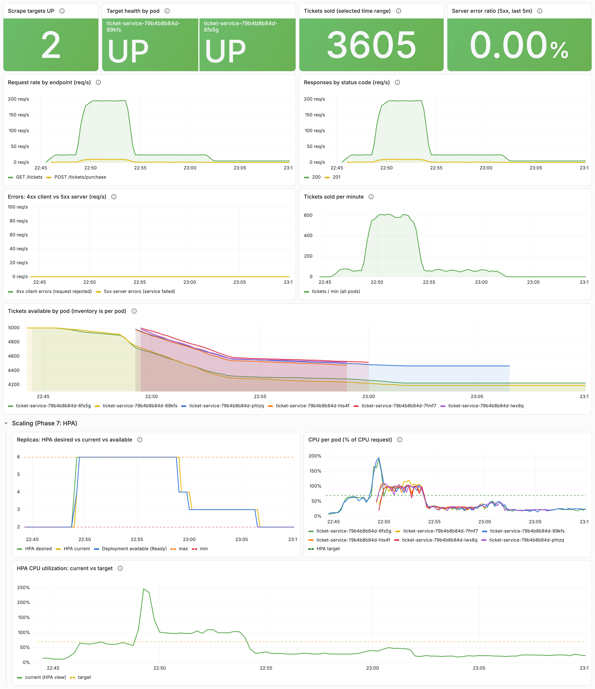

# Demo walkthrough

A guided tour of what CloudOps Bridge does, using only procedures that have been run and verified on a live kind cluster. Each step links to the full instructions; this page explains what to look at and why it matters.

> **Timing.** The verified on-sale scenario takes about 16 minutes of traffic, plus up to 5 minutes for scale-down. A shortened 3–5 minute version is **not** provided yet, because a shorter traffic profile hasn't been tested.

> Code blocks contain only commands (no `#` comments), so they paste cleanly into zsh. Run them from the repository root.

## 0. Deploy

Follow the [Quick start](../README.md#quick-start-kind). At the end, both Deployments should be `2/2` and the HPA should report a CPU percentage:

```bash
kubectl -n cloudops-bridge get deploy,hpa
```

If the HPA shows `<unknown>/70%`, metrics-server is still collecting its first samples; check again after a minute.

Start these port-forwards, each in its own terminal tab:

```bash
kubectl -n monitoring port-forward svc/grafana 13000:3000
```

```bash
kubectl -n monitoring port-forward svc/prometheus 19090:9090
```

```bash
kubectl -n monitoring port-forward svc/alertmanager 19093:9093
```

## 1. The dashboard (about 1 minute)

Copy the Grafana password to the clipboard, open http://localhost:13000 and log in as `admin`:

```bash
kubectl -n monitoring get secret grafana-admin -o jsonpath='{.data.admin-password}' | base64 -d | pbcopy
```

Open **CloudOps Bridge - Ticket Service Overview**. What to point out:

- **Target health by pod:** Prometheus scrapes every pod directly, found through the Kubernetes API.
- **Tickets available by pod:** shown per pod and never summed, because each replica has its own in-memory inventory (a deliberate, documented limitation).
- **Scaling row:** HPA desired, current and available replicas; CPU per pod as a percentage of its request; the HPA's own utilization against its 70% target.



## 2. The ticket on-sale spike (about 16–21 minutes)

Start the load generator and the scaling timeline. The full procedure, including the pre-checks, is in [kubernetes/README.md, section 11](../kubernetes/README.md#11-autoscaling-hpa).

```bash
kubectl apply -f loadtest/loadgen-configmap.yaml
kubectl -n cloudops-bridge delete job ticket-sale --ignore-not-found
kubectl create -f loadtest/ticket-sale-job.yaml
python3 kubernetes/tools/scale_watch.py 1200 5
```

What to watch, in `scale_watch` and in Grafana's Scaling row (set the time range to the last 30 minutes):

1. **Normal traffic (20 req/s, 3 min):** 2 replicas at roughly 55–70% of the CPU request, inside the HPA's 10% tolerance, so nothing changes.
2. **Spike (200 req/s, 5 min):** in the measured runs, the HPA's first scale-up came about 25 s after the spike started, and it reached its maximum of 6 replicas. New pods receive traffic as soon as they're Ready, because the load generator opens a new connection per request.
3. **Recovery (20 req/s, 8 min):** CPU drops at once, but replicas stay up for 300 s (the scale-down stabilization window), then step down to 2.

The load generator's results, per stage (achieved req/s, failures by type, p95):

```bash
kubectl -n cloudops-bridge logs job/ticket-sale | grep '"event": "summary"' | python3 -m json.tool
```

Run this within 2 hours of the Job finishing: Kubernetes deletes the Job and its logs after that (`ttlSecondsAfterFinished: 7200`). Your numbers will differ from the [measured run](../README.md#results-autoscaling-under-a-ticket-on-sale-spike); the steps the HPA takes depend on timing (one run scaled 2 → 6 in one step, another 2 → 4 → 6).

## 3. A real alert, enriched by the Bridge (about 2 minutes)

This uses the end-to-end procedure in [kubernetes/monitoring/README.md, section 11](../kubernetes/monitoring/README.md#11-incident-enrichment-alertmanager--cloudops-bridge). It deliberately freezes one ticket-service process; Kubernetes restarts it on its own.

> This procedure was verified three times before the HPA was added, and again with the HPA enabled, on a cluster rebuilt from a fresh clone using the [Quick start](../README.md#quick-start-kind). In that run (2 replicas, HPA active throughout), `TicketServiceTargetDown` fired about 45 s after the freeze. Alertmanager's webhook reached the Bridge at about 52 s, and the Bridge logged `outcome=enriched` with the owners, first responder, dependency, runbook and 6 suggested checks. The resolved webhook arrived 60 s later with the same fingerprint, and Alertmanager recorded 0 failed webhook deliveries.
>
> With the HPA in place, a pod that is being removed during a scale-down can also trigger a short `TicketServiceTargetDown` (the terminating-pod case described in [kubernetes/monitoring/README.md](../kubernetes/monitoring/README.md#observations-from-testing)). That was observed once during verification; it was delivered and enriched like any other alert.

What to look at:

- **Alertmanager** (http://localhost:19093): `TicketServiceTargetDown` firing for the frozen pod, with `service="ticket-api"` and `environment="production"`.
- **The Bridge's logs**: `event=alert_processed ... outcome=enriched` and `event=incident_context` with the first responder, owners, dependency, runbook and number of suggested checks. A **resolved** notification follows after recovery, with the same fingerprint.
- **The runbook it points to:** [runbooks/ticket-service-target-down.md](../runbooks/ticket-service-target-down.md).

The README shows [an example from a verified run](../README.md#example-enriched-incident-real-values-from-the-rebuilt-cluster-run).

## 4. GitOps: what Argo CD shows (about 2 minutes)

After the [GitOps step](../README.md#gitops-with-argo-cd), Argo CD manages ticket-service from Git with automated sync and self-heal. Log in to its UI as described in [gitops/README.md](../gitops/README.md#credentials), or check from the command line:

```bash
kubectl -n argocd get application ticket-service -o jsonpath='sync={.status.sync.status} health={.status.health.status} revision={.status.sync.revision}{"\n"}'
```

What to point out:

- **Synced and Healthy are different things.** Synced means the cluster matches Git; Healthy means the workload works. In the failed-release test they were Synced and Degraded at the same time.
- **The HPA and Argo CD don't fight.** Git doesn't declare a replica count, so scaling never makes the Application OutOfSync.
- **Grafana's GitOps / Deployment Health row** shows the same sync and health status, plus the Deployment's rollout condition and their history.

The deployment, failed-release, self-heal and incident tests and their measured results are in [gitops/README.md, Verified results](../gitops/README.md#verified-results).

## 5. The webhook on its own, without a cluster (about 1 minute)

Under Docker Compose or local Python ([docs/local-development.md](local-development.md)), post a stored sample of Alertmanager's payload. This shows the Bridge's response format; it is **not** a real Alertmanager delivery:

```bash
curl -s -X POST localhost:8081/webhooks/alertmanager -H 'Content-Type: application/json' --data @tests/fixtures/alertmanager_target_down_firing.json | python3 -m json.tool
```

## Clean up

```bash
kind delete cluster --name cloudops-bridge
```
